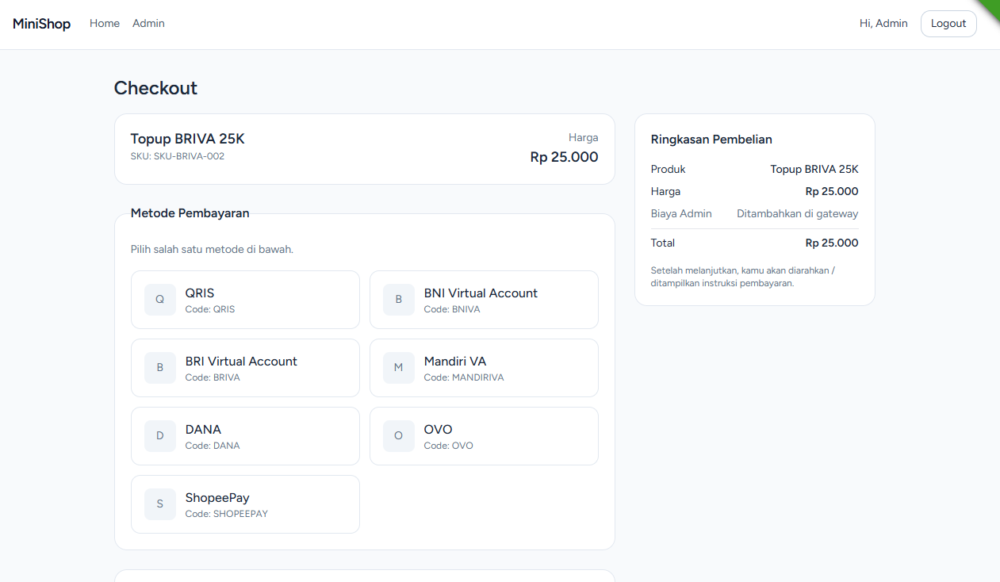

# TriPay Shop

Mini e-commerce (Laravel 12 + Inertia + Vue 3 + MySQL) untuk integrasi **TriPay**.

## Kontak
- **Nama**: Hilmi Razib Yusuf
- **Email**: hilmiyusuf197@gmail.com
- **No HP**: 0897-866-3783

## Tech Stack
- Backend: Laravel 11, Policies + Spatie Permission (RBAC)
- Frontend: Inertia.js + Vue 3, Vite
- Database: MySQL/MariaDB
- Auth: Laravel Breeze (Inertia/Vue)
- HTTP Client: Laravel HTTP Client
- Validasi FE: zod

## Fitur
- Manajemen Produk (CRUD) oleh Admin
- Tampilkan daftar produk di homepage (publik)
- Checkout produk → pilih metode pembayaran → redirect ke halaman **TriPay Checkout**
- Simpan invoice + respons TriPay (reference, checkout_url, status, raw JSON)
- Callback (webhook) untuk update status invoice (PAID/EXPIRED)
- Daftar invoice:
  - **Admin**: semua invoice
  - **Customer**: invoice miliknya

## 📸 Screenshots

### Homepage Produk

### Admin Dashboard

### Manajemen Produk (Admin)

### Checkout Flow

## Cara Menjalankan (Local)
1. `composer install`
2. `cp .env.example .env` lalu isi DB
3. `php artisan key:generate`
4. Buat DB `tripay_shop`, lalu `php artisan migrate --seed`
5. Jalankan:
   - Backend: `php artisan serve` (http://localhost:8000)
   - Frontend: `pnpm dev`
6. Buka `http://localhost:8000`

## Admin
email: admin@tripayshop.local
password: password123
